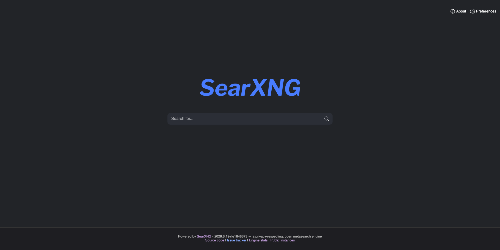

If you don't want to use a search engine that is hosted by a big company like Google or Microsoft, you can host your own search engine with SearXNG.
SearXNG is a meta-search engine that aggregates results from different search engines. This is better in terms of privacy compared to using those search engines directly.

I use SearXNG just locally on my machine, but you can of course host this yourself. In fact, you can also use a publicly hosted instance of SearXNG. This tutorial is limited to just a simple localhost instance of SearXNG.

To get started with hosting a local instance of SearXNG, you will need Docker installed on your machine.

> In some cases your SearXNG instance might be blocked by an engine after having received too many requests from your server.

## Setup

1. Create the enviroment:

```bash
# Create the environment and configuration directories
mkdir -p ./searxng/core-config/
cd ./searxng/

# Fetch the latest compose template
curl -fsSL \
    -O https://raw.githubusercontent.com/searxng/searxng/master/container/docker-compose.yml \
    -O https://raw.githubusercontent.com/searxng/searxng/master/container/.env.example
```

2. Copy the .env.example file and edit the values as needed:

```bash
cp -i .env.example .env
vim .env
```

3. Start the services:

```bash
docker compose up -d
```

4. You can open SearXNG by navigating to `localhost:8080` (or whatever port you have configured):


