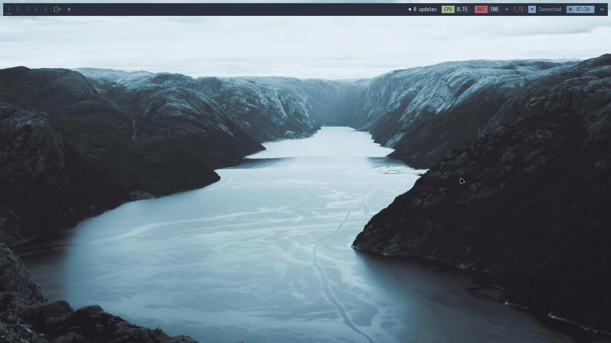

Recently I have done a bit of distro-hopping before landing on something I like.
I want from Artix to CachyOS to good old Linux Mint. I liked setting up my own OS with Artix and CachyOS had great performance, but after breaking my installation a few too many times, I decided to swith to Linux Mint.

Something I really liked about both Artix and CachyOS is that they're both Arch-based. You get the most recent packages and for the most part get to install whatever you want. I installed DWM on both using the handy [LARBS script](https://github.com/LukeSmithxyz/LARBS) by Luke Smith. He has configured DWM with some great, natural feeling keybinds that make using my laptop fun and easy.

DWM is a tiling window manager that is developed by [Suckless software](https://suckless.org/) and written in C. The aim of the project is to write a minimalistic window manager that can be configured and patched by editing the source code.  

I came across [this video by Mental Outlaw](https://youtu.be/1TjqzwvBj8U?si=dXoU8JUs2D1u-rPa) showcasing a [fork of DWM](https://github.com/siduck/chadwm) that has been configured by Siduck to look really sleek and wanted to try it on my CachyOS installation. Unfortunately some packages broke that made my system unusable. Since it was a really fresh installation, I decided to just install Linux Mint

I still wanted to use DWM or Chadwm and luckily enough installing Chadwm was really easy on Linux Mint, since I could use LightDM to switch my DE/WM from Cinnamon to Chadwm. I configured Chadwm with mostly the same keybinds that DWM in Larbs uses. I also made a fork of the ST (Simple Terminal) version by Siduck to use alongside my configuration of Chadwm. 

Chadwm looks pretty good out of the box, but I still wanted to change the looks a bit. I applied the Nord theme and set my own wallpaper. I also added Nord colors to my ST configuration.

There are still a few things I want to improve in my configuration, like a keybind to open a file manager and a keybind to reboot and shutdown like the Luke Smith configuration of DWM has. Maybe I will even write a nice installation script that makes it easy to deploy my configuration in case I want to install it again on a fresh installation of Linux Mint or another distro.

Here is the link to [my configuration of Chadwm](https://github.com/tcvscheppingen/chadwm) and here is the link to [my configuration of ST](https://github.com/tcvscheppingen/st).

