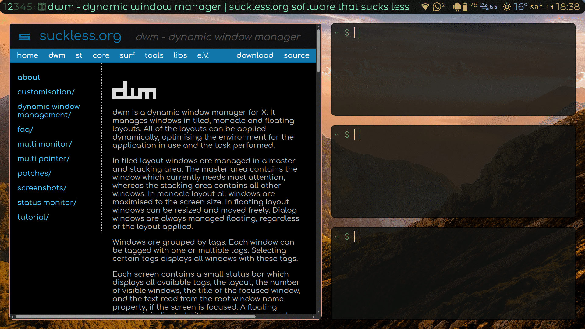
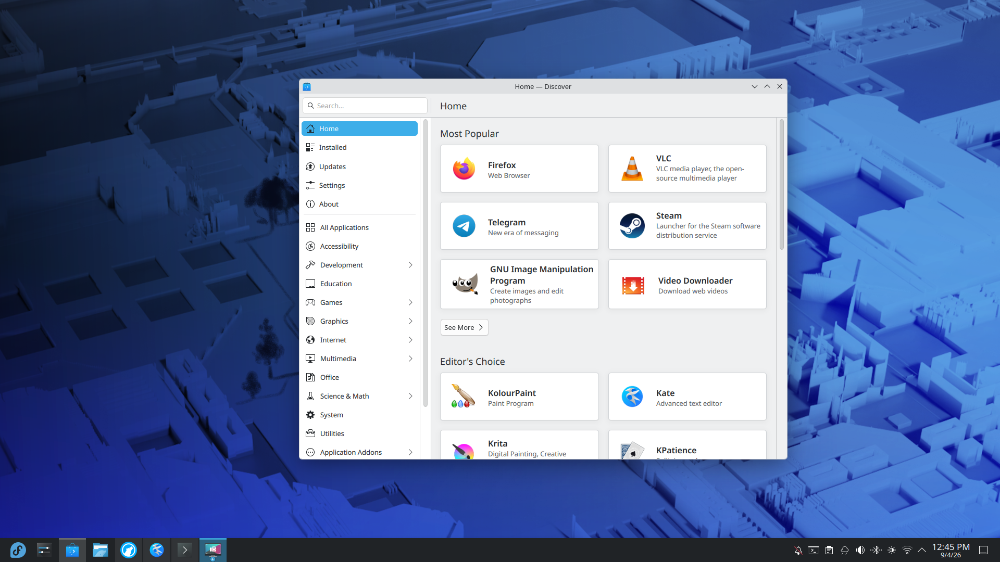

import { YouTube } from "@astro-community/astro-embed-youtube";

The past few weeks I have tried multiple window managers and desktop environments.
Using a tiling window manager taught me something about why using computers (and other devices with a screen) can be so addictive.
Before I share my thoughts, I will briefly explain what I mean by (tiling) window managers and desktop environments.

In short, a window manager (WM) is a program that controls how windows are placed and displayed on a computer screen.
A desktop environment (DE) is collection of programs that make up the GUI of the operating system. Usually a WM is part of a larger DE, but some window managers can also be used without a DE.
KDE Plasma and XFCE are examples of desktop environments and DWM, Sway and i3 are examples of window managers.

A tiling window manager is a WM that arranges windows automatically.

There are also floating window managers that don't automatically arrange windows, but instead has windows floating on top of the desktop or other windows.
Kwin in KDE Plasma is an example of a floating window manager:

Now that I have explained what a tiling window manager is, I will share what using one has taught me about getting addicted to using screens.

A tiling window manager is very satisfying to use after getting used to it.
A small keystroke pulls up a browser window which automatically gets set to the right size by the WM. 
Another keystroke opens up a terminal and both windows get resized automatically.

It can feel like being a hacker in an old movie: with the press of a few buttons a lot of movement happens on the screen.
I think the large difference between action and result is what makes using a tiling window manager so fun and satisfying, let me explain what I mean.

The action taken by the user is pressing a combination of buttons, maybe `super/command + W` to open a browser window.
That action requires very little effort from the user: both keys can easily be reached with one hand.
But the result of that action, at least visually, is quite large: the entire screen changes and a lot of movement is shown as the window properly sized.
There is a lot of visual feedback as a result of a small action.

The video below shows how much visual stimuli tiling window manager can give in response to a few keystrokes:
<YouTube id="https://www.youtube.com/watch?v=XK7gal3Wrtk"/>

In the world of UX design it is quite important to give users feedback after they perform an action, this lets the user know that their input was received.
My assumption is that the ratio between action and result is a part of what makes a piece of software or technology satisfying to use.

That brings me to what I learned about screen addiction. I use the phrase _screen addiction_ very intentionally in this case.
I am not talking about social media addiction, or gaming addiction, but screen addiction in a very literal sense.
More specifically I am talking about screens that respond to user input.

Screens are very good at drawing and keeping our attention to them. It is well known that movement captures our attention far more than static objects or images.
Most screens draw our attention because of just the movement that happens on them. Think of electronic billboards as an example of this.
I think screens that respond to our actions are even better at keeping us hooked and not just because of their content.

In 'real life' most actions take more effort before they are rewarded compared to the 'digital world´. 
A heavy crate requires large effort before it visually responds to our effort.
A touch screen responds immediately to our action, making the ratio between action and result larger.

Humans are quite lazy creatures and any small action with a large result is subconsciously viewed as a rewarding action, because in some literal sense it is rewarding.
I think a piece of technology with a large effort to result ratio is inherently an addictive technology. I am using the word _addiction_ in its broadest sense.
Of course the degree of addictiveness varies greatly between different technologies and the content of a screen probably plays a bigger role in how addictive something is than just mere visual stimulation. Reading a book is not nearly as addictive as watching a bunch of short-form videos, even when done on the same screen.

My point is merely to illustrate why screens are a somewhat inherently addictive technology, regardless of the content on that screen.
A baby is not able to understand the contents of almost any screen, yet their attention is quite easily drawn to them.

Maybe some advice would be a good conclusion to this post, but I think I cannot give any advice without stating more of the obvious.
Just go outside every once in a while, talk to a friend, read a book. Just do things that take some effort before rewarding you.
At least more effort than tapping or clicking things on a screen.

